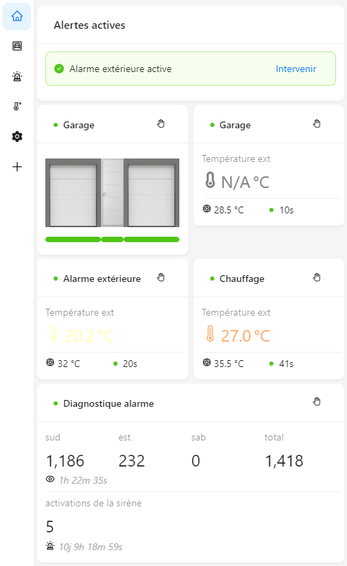
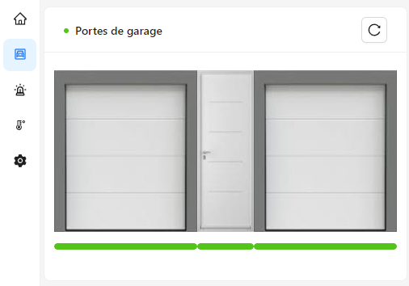
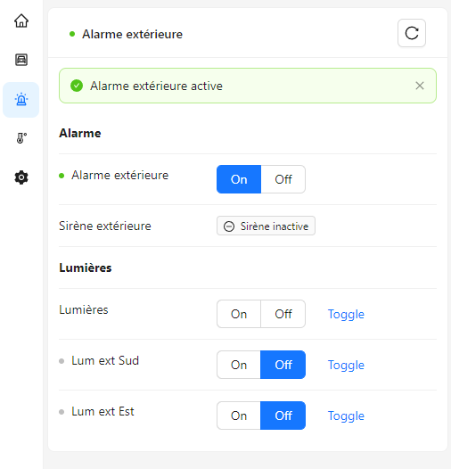
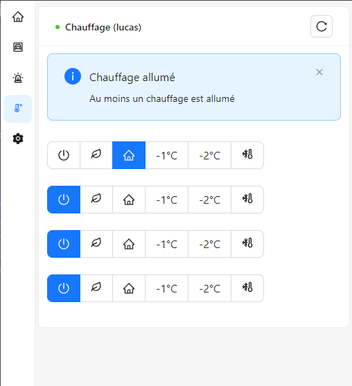

# CANIOT Rust Controller

This personal project aims to build a controller for automation devices I developed for my house, utilizing a CAN bus network. This controller currently manages the following devices:

- Heaters controller
- Alarm controller
- Garage door controller

Source code of these devices in available in the [caniot-device repository](git@github.com:lucasdietrich/caniot-device.git).

The controller is composed of a backend written in Rust serving a frontend application written in TypeScript, React and Ant Design.
Both communicate through a GRPC API.

This new controller targets Linux platforms (particularly the Raspberry Pi 2) and is the successor of [my previous stm32/zephyr controller](https://github.com/lucasdietrich/zephyr-caniot-controller).

I use Yocto to build a custom Linux distribution for my Raspberry Pi 2.

## Overview

 
 

## Build for Raspberry Pi 2

Requirements:

- [Rust](https://www.rust-lang.org/tools/install) version 1.71.0
  - Rustup target `armv7-unknown-linux-gnueabihf` (install with `rustup target add armv7-unknown-linux-gnueabihf`)
- Yocto Poky SDK for Raspberry Pi 2 (_Hypirl_ personnal distribution)
- `sudo dnf install protobuf-compiler protobuf-devel`
- `sudo dnf install grpcurl` (optional: for testing purpose)

Configure `~/.cargo/config` with

```
[target.armv7-unknown-linux-gnueabihf]
linker = "/opt/poky/hypirl-rpi-1.0/sysroots/x86_64-pokysdk-linux/usr/bin/arm-poky-linux-gnueabi/arm-poky-linux-gnueabi-gcc"
rustflags = [
"-C", "link-arg=-mthumb",
"-C", "link-arg=-mfpu=neon-vfpv4",
"-C", "link-arg=-mfloat-abi=hard",
"-C", "link-arg=-mcpu=cortex-a7",
"-C", "link-arg=-fstack-protector-strong",
"-C", "link-arg=-O2",
"-C", "link-arg=-D_FORTIFY_SOURCE=2",
"-C", "link-arg=-Wformat",
"-C", "link-arg=-Wformat-security",
"-C", "link-arg=--sysroot=/opt/poky/hypirl-rpi-1.0/sysroots/cortexa7t2hf-neon-vfpv4-poky-linux-gnueabi",
]
```

Build with

    cargo build --target=armv7-unknown-linux-gnueabihf --release --verbose`

## Run

Configuration file is `caniot-controller.toml` in the current directory.

```
[can]
interface = "can0"

[web]
port = 8080
listen = "0.0.0.0"

[grpc]
listen = "[::]:50051"
```

Run with

    ./caniot-controller

## TODO (controller)

- Search for `todo` or `dead_code` or `unimplemented` in the code.
- Allow to set custom configuration file path: `./caniot-controller -c /etc/caniot/caniot-controller.toml`
- Timestamp received CAN frames (wait for this feature of `socketcan` crate https://github.com/socketcan-rs/socketcan-rs/issues/22)
- Improve logging: make this shorter `[2023-09-24T09:46:24.759Z INFO  caniot_rctrl::can] RX Telemetry Response (9: 1,1): ep-2 / 12 00 11 00 14 00 22 00` -> `[2023-09-24T09:46:24.759Z INFO can] RX Telemetry Response (9: 1,1): ep-2 / 12 00 11 00 14 00 22 00`
- Logger
- Offline in a dedicated thread the reception of can frame in order to precisely timestamp them.
- Events/alarms and logger
- Notification by email
- Firmware infos/update, CPU usage, memory usage, system time, uptime, etc...
- Multiple controllers per device
- CANIOT features support
- Prometheus metrics (exporter), form:
- Device update
- Device diagnostics
- Heaters: auto disable heaters on certain conditions (job days, morning, evening, temperature)
- Add support for bluetooth devices
- Add support for rooms associated sensors
- wrap all services (spawn) in a single Application structure
- Allow to send comment to non-existing (yet) devices
- Remove `unwrap`
  - At least change them to `expect` with a meaningful message
- Add stats for GRPC API and other services
- transform `BlcClassTelemetry` to trait in order to have:
  - problems: how to know which class to use? as it is not in the ResponseData -> add get_class() method to the controller
    ```rust
        fn handle_frame(
            &mut self,
            frame: &caniot::ResponseData,
            _ctx: &mut ProcessContext,
        ) -> Result<crate::controller::Verdict, DeviceError> {
            let telemetry: class0::Telemetry = frame.as::<class0::Telemetry>()?;
        }
    ```
- Handle events
- Implement device reset action
- Implement inhibit mode for devices
- Settings: Add cache for Settings to avoid reading the database at each request and avoid writing the database if the value is the same
- Settings: handle settings default values
- How to compare to make sure the result is expected for the action ?
- Test how the controller behaves with delayed responses or timouts
- Try to get rid of the `handle_action_result()` method, find a way to merge it with `handle_action()`
- Allow to use a remote controller as a can interface (Hardware in the loop), using the GRPC API
- Compute stats based on measures (today min, max, last and a curve showing the trend)
- treat the case where the process() function of a device controller sends a frame for which the response trigger a new process() call, leading to a infinite loop
- improve call of process() in emulated devices
- event/log system
- send broadcast frame on startup
- handle broadcast pending queries
- controller cron jobs
- start http server if datbase is not available
- Check if usage of naive_utc() is ok ?
- Try to merge device actions and jobs. Can an action be a scheduled job ?
- Retrieve time from function argument instead of calling Utc::now() or Local::now() everywhere
- Allow to log to file
- Use nginx instead of rocket to server static files (UI)
- outdoor alarm: Double detection
- reorder heaters buttons in ui
- implement BLE devices (add transport layer abstraction)
- improve the configuration handling:
  - reseting device configuration
  - remove async callback from the device configuration

## TODO (UI)

- Implement `compactAlgorithm` theme with dark mode
  - built 2MB un peu gros,
- ~~Solve the resolution problem of: `import { Timestamp } from "google-protobuf/google/protobuf/timestamp_pb";`~~
- Split built ui in chunks for faster loading
  - `rollupOptions`
- Call front-end router
- Correctly select the route (in the menu) when the URL is directly accessed
- Make the UI layout compatible with mobile devices
- Introduce a 'Settings' class to abstract the settings management
- Add modal for reboot and reset settings of a device (to confirm the action)
- Refresh devices table dynamically after a reset/reset settings
- Add alert when an action has been sent to a device
- TODO: select the menu item depending on the current route: `const url = window.location.href;` ?
- notification: Fix "showProgress" and "pause on hover and progress"
- Push notifications on devices without developping a mobile app
  - https://www.pushbullet.com/
  - https://pushover.net/
- AWS amazon https://aws.amazon.com/fr/sns/
- Mettre un bouton pour se reconnecter en cas de perte de connexion

### Evaluate `react-media` for responsive design

- <https://www.npmjs.com/package/react-media>

```jsx
const queries = {
  "screen-mobile": {
    maxWidth: 575,
  },
  "screen-large": {
    minWidth: 576,
  },
};

<Media queries={queries}>
  {(matches) => (
    <Sider
      style={{ background: colorBgContainer }}
      collapsed={matches["screen-mobile"]}
      collapsedWidth={50}
      width={250}
    >
      <AppMenu settings={settings} />
    </Sider>
  )}
</Media>;
```

## Icons

- Icons libraries:
  - https://ant.design/components/icon
  - https://react-icons.github.io/react-icons/

## Antd demo site:

- Repo: https://github.com/ant-design/ant-design-pro
- Website: https://pro.ant.design/

## Last run

```
Logiciel
Status
Running
Version
0.2.1
Build date
07/07/2024, 11:53:57
Build commit
32e51baa3b0b40117d9a7662244604bc396c2ebd (dirty)
Derrière mise à jour
Jamais
Dernier lancement
07/07/2024, 12:05:35
Heure système
18/07/2024, 20:47:00

Firmware
Distribution
hypirl
Version de distribution
scarthgap
Date de build
N/A

Statistiques du contrôleur
CAN Interface RX
56257
CAN Interface TX
91
CAN Interface Errors
0
CAN Interface Malformed
164
Pending queries pushed
71
Pending queries answered
71
Pending queries timeout
0
Duplicate pending queries dropped
0
Internal API calls
132935
```
