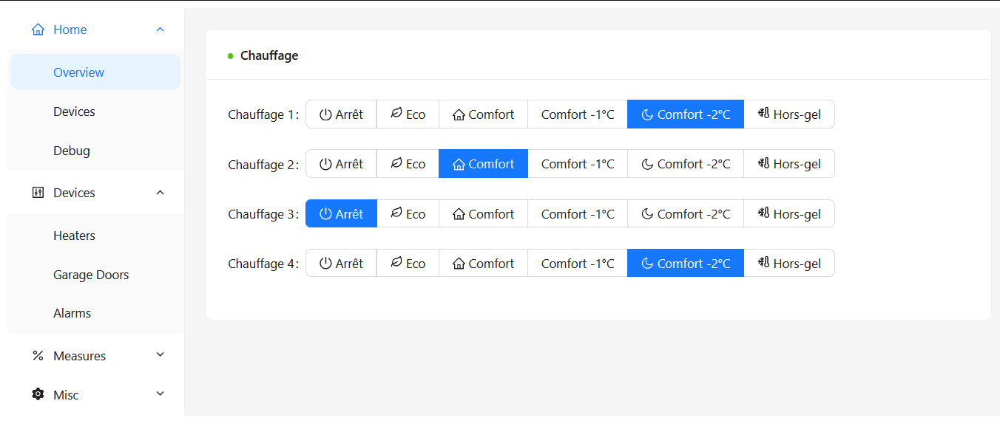

# CANIOT Rust Controller

## Overview



## Build for Raspberry Pi 3

Requirements:

- [Rust](https://www.rust-lang.org/tools/install) version 1.71.0
  - Rustup target `armv7-unknown-linux-gnueabihf` (install with `rustup target add armv7-unknown-linux-gnueabihf`)
- Yocto Poky SDK for Raspberry Pi 3 (_Hypirl_ personnal distribution)
- `sudo dnf install protobuf-compiler protobuf-devel`
- `sudo dnf install grpcurl` (optional: for testing purpose)

Configure `~/.cargo/config` with

```
[target.armv7-unknown-linux-gnueabihf]
linker = "/opt/poky/hypirl-rpi-1.0/sysroots/x86_64-pokysdk-linux/usr/bin/arm-poky-linux-gnueabi/arm-poky-linux-gnueabi-gcc"
rustflags = [
"-C", "link-arg=-mthumb",
"-C", "link-arg=-mfpu=neon-vfpv4",
"-C", "link-arg=-mfloat-abi=hard",
"-C", "link-arg=-mcpu=cortex-a7",
"-C", "link-arg=-fstack-protector-strong",
"-C", "link-arg=-O2",
"-C", "link-arg=-D_FORTIFY_SOURCE=2",
"-C", "link-arg=-Wformat",
"-C", "link-arg=-Wformat-security",
"-C", "link-arg=--sysroot=/opt/poky/hypirl-rpi-1.0/sysroots/cortexa7t2hf-neon-vfpv4-poky-linux-gnueabi",
]
```

Build with

    cargo build --target=armv7-unknown-linux-gnueabihf --release --verbose`

## Run

Configuration file is `caniot-controller.toml` in the current directory.

```
[can]
interface = "can0"

[web]
port = 8080
listen = "0.0.0.0"

[grpc]
listen = "[::]:50051"
```

Run with

    ./caniot-controller

## TODO (controller)

- Allow to set custom configuration file path: `./caniot-controller -c /etc/caniot/caniot-controller.toml`
- Timestamp received CAN frames (wait for this feature of `socketcan` crate https://github.com/socketcan-rs/socketcan-rs/issues/22)
- Improve logging: make this shorter `[2023-09-24T09:46:24.759Z INFO  caniot_rctrl::can] RX Telemetry Response (9: 1,1): ep-2 / 12 00 11 00 14 00 22 00` -> `[2023-09-24T09:46:24.759Z INFO can] RX Telemetry Response (9: 1,1): ep-2 / 12 00 11 00 14 00 22 00`
- Logger
- Database
- Offline in a dedicated thread the reception of can frame in order to precisely timestamp them.
- Events/alarms and logger
- Notification by email
- Firmware infos/update, CPU usage, memory usage, system time, uptime, etc...
- Multiple controllers per device
- CANIOT features support
- Prometheus metrics (exporter), form:
- Device update
- Device diagnostics
- Heaters: auto disable heaters on certain conditions (job days, morning, evening, temperature)
- Add support for bluetooth devices
- Add support for rooms associated sensors
- read config using -c option
- wrap all services (spawn) in a single Application structure
- increase the number of threads in the thread pool
- Allow to send comment to non-existing (yet) devices
- Remove `unwrap`
  - At least change them to `expect` with a meaningful message
- Add stats for GRPC API and other services
- transform `BlcClassTelemetry` to trait in order to have:
  - problems: how to know which class to use? as it is not in the ResponseData -> add get_class() method to the controller
    ```rust
        fn handle_frame(
            &mut self,
            frame: &caniot::ResponseData,
            _ctx: &mut ProcessContext,
        ) -> Result<crate::controller::Verdict, DeviceError> {
            let telemetry: class0::Telemetry = frame.as::<class0::Telemetry>()?;
        }
    ```
- Handle events
- Implement device reset action
- Implement inhibit mode for devices
- Settings: Add cache for Settings to avoid reading the database at each request and avoid writing the database if the value is the same
- Settings: handle settings default values
- How to compare to make sure the result is expected for the action ?
- Find a way to make the completed_by: &Option<Frame<ResponseData>> to &Frame<ResponseData> !

```
device_temperature{medium="CAN",mac="16",device="GarageDoorController",sensor="EMBEDDED",room="",collector="pycaniotcontroller"} 19.00
device_temperature{medium="CAN",mac="24",device="AlarmController",sensor="EMBEDDED",room="",collector="pycaniotcontroller"} 17.50
device_temperature{medium="CAN",mac="24",device="AlarmController",sensor="EXTERNAL",room="",collector="pycaniotcontroller"} 13.60
device_temperature{medium="CAN",mac="1",device="HeatersController",sensor="EMBEDDED",room="",collector="pycaniotcontroller"} 22.50
device_temperature{medium="CAN",mac="1",device="HeatersController",sensor="EXTERNAL",room="",collector="pycaniotcontroller"} 13.90
```

## TODO (UI)

- Implement `compactAlgorithm` theme with dark mode
  - built 2MB un peu gros,
- ~~Solve the resolution problem of: `import { Timestamp } from "google-protobuf/google/protobuf/timestamp_pb";`~~
- Split built ui in chunks for faster loading
  - `rollupOptions`
- Call front-end router
- Correctly select the route (in the menu) when the URL is directly accessed
- Make the UI layout compatible with mobile devices
- Introduce a 'Settings' class to abstract the settings management
- Add modal for reboot and reset settings of a device (to confirm the action)
- Refresh devices table dynamically after a reset/reset settings
